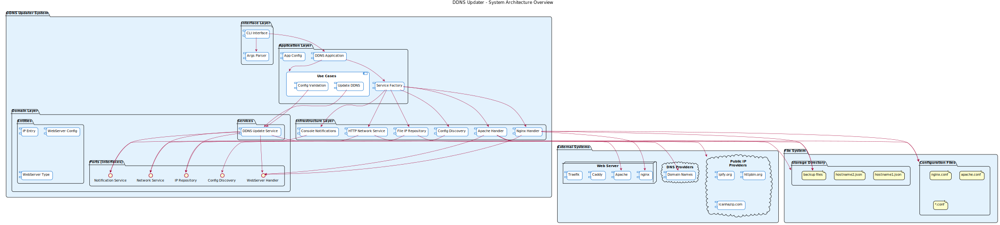
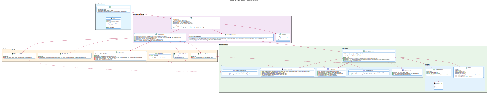
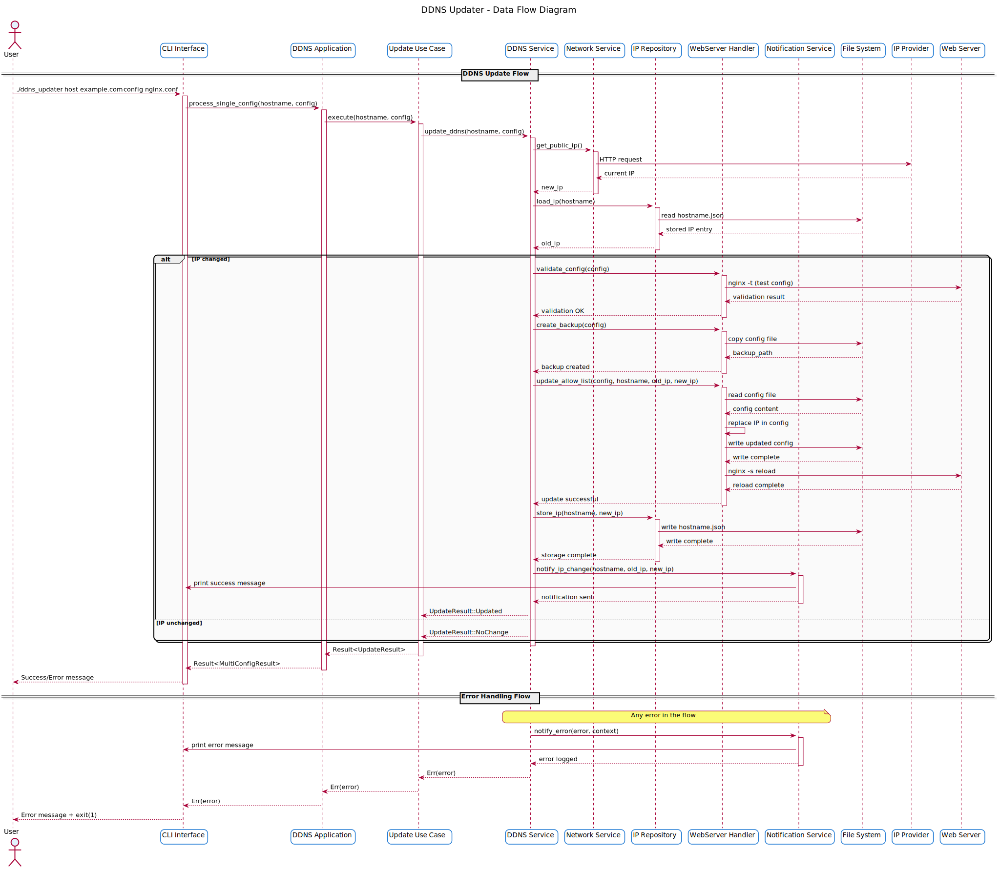
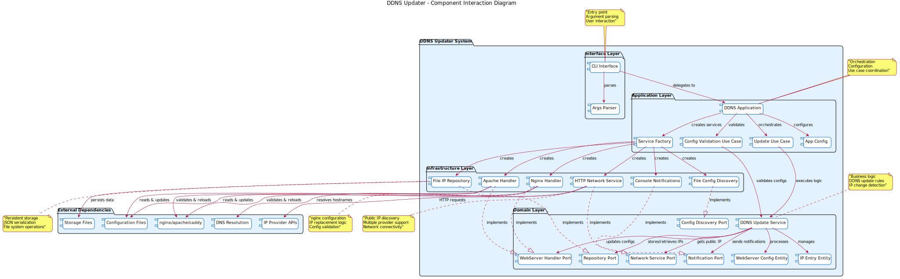
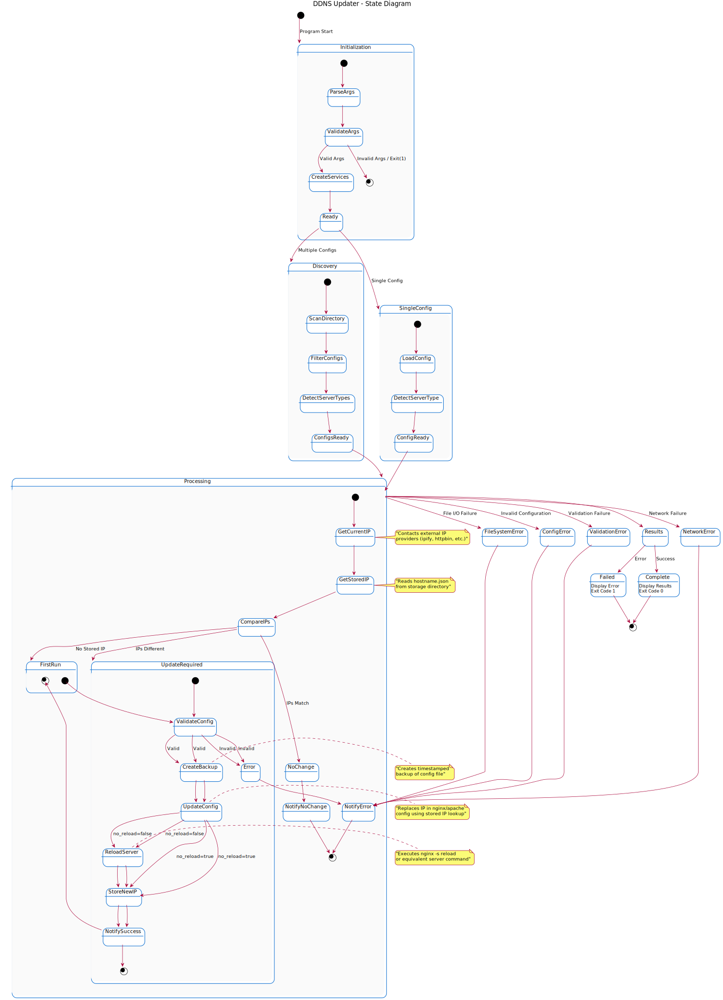
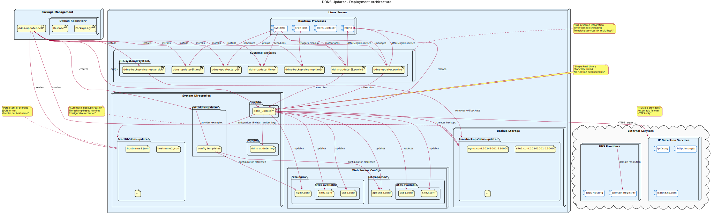

# DDNS Updater - Architecture Documentation

This directory contains comprehensive architecture documentation for the DDNS Updater project, including automatically generated diagrams from PlantUML sources.

## 📊 Architecture Diagrams

The following diagrams provide different views of the system architecture:

### System Architecture Overview


**Purpose**: High-level overview of the entire DDNS updater system showing external dependencies, internal components, and data flow between layers.

**Key Features**:
- Clean separation of concerns across architectural layers
- External service dependencies (IP providers, DNS, web servers)
- File system interactions for configuration and storage
- Service factory pattern for dependency injection

### Clean Architecture Layers


**Purpose**: Detailed view of the clean architecture implementation showing how dependency inversion is achieved through trait-based design.

**Key Features**:
- **Interface Layer**: CLI parsing and user interaction
- **Application Layer**: Use cases, service factory, and application configuration
- **Domain Layer**: Business entities, services, and ports (interfaces)
- **Infrastructure Layer**: Concrete implementations of domain ports

### Data Flow Diagram


**Purpose**: Step-by-step sequence showing how a DDNS update request flows through the system from CLI input to completion.

**Key Features**:
- Complete update lifecycle from CLI invocation to completion
- Error handling paths and recovery mechanisms
- External service interactions (IP providers, web servers)
- Data persistence and notification flows

### Component Interaction


**Purpose**: Detailed component relationships showing how different parts of the system interact and depend on each other.

**Key Features**:
- Inter-component communication patterns
- Dependency injection through service factory
- Port-adapter pattern implementation
- External dependency management

### State Diagram


**Purpose**: State machine representation of the DDNS update process showing all possible states and transitions.

**Key Features**:
- Complete state transitions from initialization to completion
- Error state handling and recovery paths
- Conditional flows based on IP comparison results
- Multi-configuration vs single-configuration processing paths

### Deployment Architecture


**Purpose**: Production deployment view showing system installation, file locations, and runtime dependencies.

**Key Features**:
- Debian package installation structure
- Systemd service integration and management
- File system layout and permissions
- Backup and logging infrastructure
- External service dependencies

## 🔧 Diagram Generation

### Automatic Generation
Architecture diagrams are automatically generated using GitHub Actions whenever PlantUML source files are modified:

1. **Trigger**: Push to main branch or PR with changes to `docs/diagrams/*.puml`
2. **Process**: PlantUML GitHub Action generates SVG and PNG versions
3. **Output**: Generated diagrams are saved to `docs/images/`
4. **Commit**: Changes are automatically committed back to the repository

### Manual Generation
To generate diagrams locally:

```bash
# Install PlantUML
sudo apt-get install plantuml

# Generate all diagrams
plantuml -tsvg -o ../images docs/diagrams/*.puml
plantuml -tpng -o ../images docs/diagrams/*.puml
```

### Source Files
PlantUML source files are located in `docs/diagrams/`:

- `system-architecture.puml` - Overall system architecture
- `clean-architecture.puml` - Clean architecture layers and dependencies  
- `data-flow.puml` - Data flow and sequence diagrams
- `component-interaction.puml` - Component relationships and interactions
- `state-diagram.puml` - State machine and process flow
- `deployment.puml` - Deployment and infrastructure architecture

## 📝 Architecture Decisions

### Clean Architecture Implementation
The DDNS updater follows clean architecture principles:

1. **Dependency Inversion**: All dependencies flow inward toward the domain layer
2. **Trait-Based Design**: Interfaces (ports) defined as Rust traits
3. **Separation of Concerns**: Each layer has distinct responsibilities
4. **Testability**: Each component can be tested in isolation

### Multi-Web Server Support
The system is designed to support multiple web servers through a common interface:

- ✅ **Nginx**: Complete implementation with location block handling
- ✅ **Apache**: Complete implementation with Directory/Location blocks  
- 🔲 **Caddy**: Framework ready for implementation
- 🔲 **Traefik**: Framework ready for implementation

### Async Architecture
Full async/await support throughout:

- **Tokio Runtime**: Single-threaded async runtime for CLI application
- **Async Traits**: All service boundaries use async trait implementations
- **Thread Safety**: Send + Sync bounds for all shared components
- **Error Handling**: Comprehensive error types with async propagation

### Configuration Management
Flexible configuration discovery and validation:

- **Pattern Matching**: Support for glob patterns (*.conf, *.nginx, etc.)
- **Auto-Detection**: Automatic web server type detection from config content
- **Validation**: Configuration syntax validation before updates
- **Backup Management**: Automatic backup creation with configurable retention

## 🧪 Testing Architecture

The testing strategy aligns with the architectural layers:

### Unit Tests
- **Domain Layer**: Business logic validation
- **Infrastructure Layer**: Individual component testing  
- **Application Layer**: Service factory and use case testing

### Integration Tests
- **CLI Interface**: End-to-end command line testing
- **File System**: Configuration file processing
- **Network Services**: IP provider integration (with CI-friendly mocking)

### Architecture Tests
- **Dependency Rules**: Ensure clean architecture boundaries are maintained
- **Trait Implementation**: Verify all ports have proper implementations
- **Error Handling**: Comprehensive error scenario coverage

## 🚀 CI/CD Integration

### GitHub Actions Workflows
1. **Diagram Generation**: Automatic PlantUML rendering on source changes
2. **Testing Pipeline**: Comprehensive test suite with CI environment detection
3. **Package Building**: Debian package generation for multiple architectures
4. **Documentation**: Automatic documentation updates

### Quality Assurance
- **Code Formatting**: Automatic rustfmt application
- **Linting**: Clippy analysis with architectural rule enforcement
- **Dependency Auditing**: Security vulnerability scanning
- **Performance Testing**: Benchmark regression detection

## 📚 Related Documentation

- **[CLEAN_ARCHITECTURE.md](../CLEAN_ARCHITECTURE.md)**: Detailed clean architecture implementation notes
- **[CI_COMPATIBILITY.md](../CI_COMPATIBILITY.md)**: GitHub Actions CI compatibility documentation
- **[TESTING.md](../TESTING.md)**: Comprehensive testing strategy and results
- **[README.md](../README.md)**: Main project documentation and usage guide

---

**Note**: All diagrams are automatically generated from PlantUML sources. To modify diagrams, edit the corresponding `.puml` files in `docs/diagrams/` and they will be regenerated automatically by GitHub Actions.